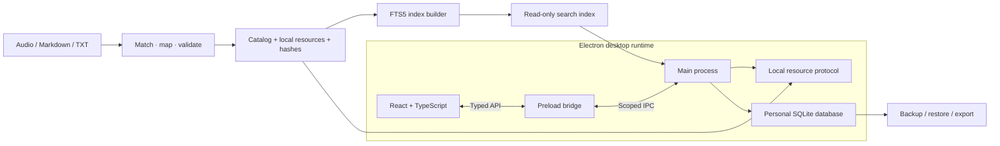

<div align="center">

# 学匣 · LearnKit

### 从音频与文稿，到你自己的桌面学习应用

**A reusable desktop learning framework for audio, reading, notes, and review.**

[](LICENSE)
[](app/package.json)
[](#平台与项目状态)
[](app/package.json)
[](app/package.json)
[](app/package.json)

**简体中文** · [English](docs/i18n/README.en.md) · [日本語](docs/i18n/README.ja.md) · [한국어](docs/i18n/README.ko.md)

[快速启动](#快速启动) · [架构设计](#架构设计) · [导入自己的课程](#导入自己的课程) · [AI 开发指南](docs/AI_GUIDE.md) · [参与贡献](CONTRIBUTING.md)

</div>

---

## 项目定位

LearnKit 是面向开发者、内容创作者和 AI 编程工具的**本地学习应用框架**。它把资料处理、桌面运行环境、听读交互和个人学习数据管理连接起来，让你在现有代码基础上构建自己的课程应用。

准备音频与文稿，核对配对关系，生成课程库，再调整品牌与界面——不必从头实现播放器、阅读器、笔记、学习计划和备份系统。

框架附带四门自制演示课程，公开仓库只包含代码、文档与自制文本示例。运行时无需账号、激活码或云服务，也不依赖 AI API。


*真实应用截图，使用自制演示数据。多语言支持目前覆盖项目文档；应用界面当前以中文为主。*

## 功能模块

| 模块 | 已实现能力 |
| --- | --- |
| **课程资料管线** | 同名音文配对、明确映射、冲突报告、稳定课程 ID、资源 SHA256、临时目录生成与课程库替换 |
| **音频工作空间** | 跨页面持续播放、倍速、音量、播放队列、连续播放、定时停止、音频书签与断点继续 |
| **文稿阅读** | Markdown/TXT、中文全文搜索、段落定位、文内查找、字号/主题/版心设置、本地插图 |
| **笔记与批注** | 课程笔记、独立笔记、摘录、标签、图片附件、划线、段落书签、Markdown/PDF 导出 |
| **学习与复习** | 自选课程计划、每日目标、实际听读计时、已听覆盖、间隔复习卡片与自评反馈 |
| **数据生命周期** | SQLite 持久化、数据库升级、自动与手动备份、恢复前校验、删除撤销与恢复 |

分组、课程目录和首页统计由实际资料生成，不绑定特定作者、固定六季或预设课程数量。

## 技术栈

| 层级 | 技术 / 当前版本 | 用途 |
| --- | --- | --- |
| 桌面容器 | **Electron 44.5.1** | 窗口、媒体播放、受控本地资源、系统文件操作与程序分发 |
| 界面层 | **React 19.3.0 + TypeScript 7.0.2** | 类型化组件、阅读与播放的独立状态、笔记和学习交互 |
| 构建工具 | **Vite 8.3.2 + @electron/packager 20.3.0** | 前端构建、Electron ASAR 与 Windows 程序打包 |
| 数据层 | **SQLite / `node:sqlite`** | 个人记录持久化、迁移、事务与一致性快照 |
| 搜索层 | **SQLite FTS5 / trigram** | 中文正文索引；短关键词回退检索与笔记合并查询 |
| 文稿渲染 | **react-markdown 10.1.0 + remark-gfm 4.0.1** | Markdown、表格与结构化正文显示 |
| 视觉基础 | **自定义 CSS + Lucide React 1.51.0** | 布局、主题、窗口适配和 SVG 图标 |
| 资料工具 | **Node.js ESM / 内置文件与加密模块** | 文件扫描、明确映射、稳定 ID、逐文件校验与索引生成 |
| 验证工具 | **Node Test Runner + 可选 Playwright** | 导入/数据回归与真实 Electron 窗口检查 |

版本以 [package.json](app/package.json) 和 [package-lock.json](app/package-lock.json) 为准。开发环境需要 **Node.js ≥ 24.13.0**；终端用户运行打包程序时无需安装 Node.js。

## 架构设计



- **资料与个人数据分离**：课程库和搜索索引随程序分发；笔记、进度、计划与复习存放在 Windows 用户数据目录。
- **播放与阅读分离**：播放器保留独立生命周期，切换页面或阅读其他课程不会卸载当前音频。
- **身份稳定**：课程与段落使用稳定 ID，应用身份和课程库身份独立于展示名称；资料更新不会主动删除个人记录。
- **受控进程边界**：React 渲染器通过 preload API 与主进程通信，保留 `contextIsolation`、sandbox、CSP 和资源路径校验。
- **本地运行闭环**：文稿、音频、搜索、笔记和备份均在本机完成；开发时安装依赖和获取 Electron 运行库需要网络或预备离线文件。

详细职责、数据流和修改入口见 [架构说明](docs/ARCHITECTURE.md)。

## 快速启动

```powershell
git clone https://github.com/shianlab/learnkit.git
cd learnkit
npm --prefix app ci
npm --prefix app run prepare:demo
npm --prefix app run dev
```

自制示例包含两个分组、四门课程：音文配对、纯文稿和纯音频。示例音频由代码生成，是低音量测试音，并非课程讲解。演示生成器会拒绝覆盖已导入的自定义课程库。

## 导入自己的课程

### 1. 整理输入目录

```text
course-input/
├── 基础/
│   ├── 01-第一讲.md
│   ├── 01-第一讲.mp3
│   └── 02-第二讲.txt
└── 进阶/
    ├── 01-第三讲.md
    └── 01-第三讲.m4a
```

同一分组下，同名音频与文稿自动配对；单独文稿或音频也可保留。支持分开的 `audio` / `texts` 或 `音频` / `文稿` 容器目录。同名候选不唯一时，导入停止并报告冲突。

### 2. 先核对，再生成

```powershell
npm --prefix app run import:library -- --input ../course-input --dry-run
# 检查 build/import-report.json，处理冲突后再导入
npm --prefix app run import:library -- --input ../course-input
npm --prefix app run dev
```

文件名不一致时，可以通过 `courses.json` 明确指定音文对应关系、课程 ID、分组、标题和作者。完整格式见 [导入指南](docs/IMPORT.md)。

| 内容 | 当前支持 |
| --- | --- |
| 文稿 | UTF-8 Markdown、TXT |
| 音频 | MP3、M4A、WAV、OGG、FLAC |
| 文稿插图 | 本地 PNG、JPEG、WebP |
| PDF / Word / 图片文稿 | 先提取为 Markdown/TXT；框架当前不提供 OCR 或文档解析 |
| 音频时长 | 导入时可选使用 ffprobe；没有它时由播放器读取实际时长 |

导入前退出正在运行的应用。重新导入会替换生成的课程库，但不主动删除个人数据；更改文件名或移动目录时，应通过映射表保留已有课程 ID。

## 品牌配置与 AI 开发

配置入口：[app/app.config.json](app/app.config.json)。

| 字段 | 作用 |
| --- | --- |
| `name` | 窗口、首页和侧栏显示名称 |
| `subtitle` | 应用说明 |
| `author` | 导入时使用的默认课程作者 |
| `appId` | 应用身份与用户数据命名空间 |
| `libraryId` | 默认课程库身份与课程 ID 生成依据 |

新制作的独立应用应使用新的 `appId`；已有应用进行品牌改名时保留其稳定数据身份。不同课程集使用不同 `libraryId`。

[AI 开发指南](docs/AI_GUIDE.md) 提供可直接复制的提示词和改造顺序：先读架构，扫描资料，核对映射，验证小样本，再扩展界面和完整分发。AI 用于开发和整理资料；应用运行本身无需接入 AI 服务。

## 开发验证

```powershell
npm --prefix app test
npm --prefix app run build
```

当前 **30 项自动回归测试**覆盖音文匹配、冲突与越界保护、七个动态分组、稳定 ID、中文检索、笔记、划线、学习计时、数据升级和备份恢复。测试使用独立自制资料，不依赖或改写你当前的课程库。

开发版与打包版已完成真实 Electron 窗口检查，涵盖跨页面持续播放、独立阅读、笔记提交、纯音频课程、搜索、动态计划、小窗口布局和重启保存。

原生演示回归需额外安装 Playwright，并先在空白副本准备示例：

```powershell
npm --prefix app install --no-save --package-lock=false playwright
node scripts/verify/smoke.mjs
# 打包后可检查实际分发目录
node scripts/verify/smoke.mjs --packaged
```

这里记录的是本机执行结果，不是持续集成状态。更多平台与实机环境仍需单独验证。

## 打包与分发

```powershell
npm --prefix app run package
```

产物：

```text
build/program/LearnKit-win32-x64/
├── LearnKit.exe
├── resources/
│   ├── app.asar
│   ├── library/
│   └── search-v1.sqlite
└── Electron runtime files...
```

分发**整个文件夹**，接收者双击 `LearnKit.exe` 即可运行，无需开发环境。不要只发送一个 EXE。产物包含导入的课程与 Electron 运行库，不包含你的个人笔记。

打包器默认获取官方 Electron 运行库；离线构建可预先放置匹配版本 ZIP 到 `tools/electron`。当前仓库提供免安装目录构建，不捆绑 Windows 安装器或自动更新服务。

## 项目结构

```text
learnkit/
├── app/
│   ├── app.config.json       # 品牌与稳定身份配置
│   ├── src/                  # React 页面、阅读器与播放器
│   ├── desktop/              # Electron、SQLite、搜索与数据服务
│   ├── scripts/              # 资料导入、索引、素材与程序打包
│   └── tests/                # 自动回归与独立测试资料
├── examples/course-input/    # 自制文本和明确映射示例
├── scripts/verify/           # 原生 Electron 窗口回归
├── docs/                     # 架构、导入、AI 指南与多语言说明
├── AGENTS.md                 # AI 编程约定
└── CONTRIBUTING.md           # 贡献指南
```

`node_modules`、构建产物、用户课程、生成课程库、凭据和个人备份均被 Git 忽略。

## 平台与项目状态

| 项目 | 状态 |
| --- | --- |
| 版本定位 | **0.1.0 · 开发框架**，适合二次开发与验证 |
| 已验证环境 | Windows x64；开发运行及免安装程序 |
| 文档语言 | 简体中文、English、日本語、한국어 |
| 应用界面 | 当前以中文为主，尚无界面语言切换 |
| 资料导入 | 命令行与 JSON 映射；尚无应用内拖拽导入 |
| 其他平台 | macOS / Linux 需要适配与实机验证 |
| 可扩展方向 | 图形化导入、界面国际化、安装器、自动更新、可选 AI 功能 |

大量课程、多小时稳定性、多个应用同时运行及真实系统休眠仍需在对应环境验证。当前未实现 PDF/Word 解析、OCR、语音转写或云同步。

## 参与贡献

欢迎通过 [Issues](https://github.com/shianlab/learnkit/issues) 反馈问题，通过 Pull Request 提交改进。请附复现步骤、预期行为、环境信息与验证结果；涉及个人数据时使用自制样本。

贡献流程见 [CONTRIBUTING.md](CONTRIBUTING.md)。AI 编程工具应先读取 [AGENTS.md](AGENTS.md)。

## 许可

项目自行编写的代码、文档、自制示例和通用书本图标采用 [MIT License](LICENSE)。字体及第三方组件保留各自许可，见 [THIRD_PARTY_NOTICES.md](THIRD_PARTY_NOTICES.md)。使用者导入的课程内容不因使用本框架而改变其权利归属。
