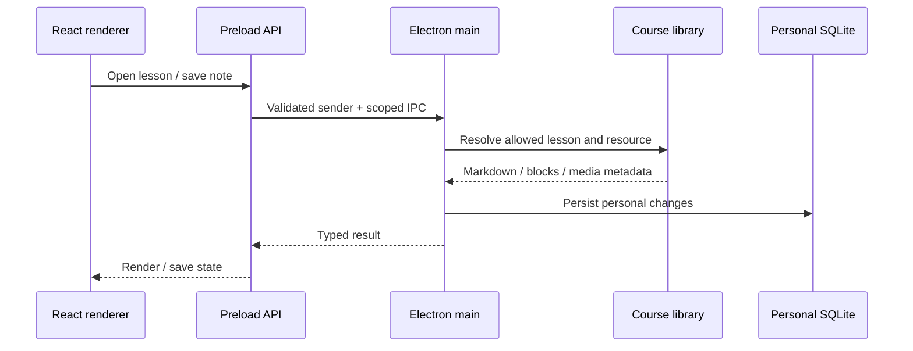

# LearnKit 架构说明

LearnKit 使用 Electron 多进程架构：React 渲染器负责交互，preload 暴露明确 API，主进程管理本地资料、SQLite、系统文件操作和应用生命周期。资料导入在开发阶段执行，应用运行时读取生成的课程库。

## 组件边界

| 组件 | 入口 | 职责 |
| --- | --- | --- |
| 品牌与身份 | app/app.config.json | 显示名称、说明、默认作者、稳定 appId / libraryId |
| 应用编排 | app/src/WorkspaceApp.tsx | 页面、持续播放、阅读选择、保存与退出握手 |
| 听读 | Reader.tsx / Player.tsx | 段落定位、批注、音频队列、媒体事件与续学 |
| 内容发现 | LibraryPage.tsx / SearchPage.tsx | 动态分组、筛选、分页、中文检索与结果跳转 |
| 学习交互 | NoteWorkspace.tsx / StudyPage.tsx / ReviewPage.tsx | 笔记、计划、计时展示与间隔复习 |
| 主进程 | app/desktop/main.cjs | 窗口、协议、IPC 注册、退出与休眠响应 |
| 进程桥接 | app/desktop/preload.cjs / app/src/types.ts | 受控 API 与 TypeScript 契约 |
| 内容服务 | library.cjs / search.cjs | 路径边界、媒体 Range 请求、目录与搜索 |
| 个人数据 | database.cjs / learning-store.cjs | SQLite、学习实体、事务和持久化 |
| 数据生命周期 | backup.cjs / upgrade.cjs / export.cjs | 快照、恢复、版本迁移和导出 |
| 资料构建 | import-library.mjs / build-search.cjs | 扫描、匹配、校验、课程库与 FTS5 索引 |
| 程序分发 | package.mjs | Electron ASAR、运行库、课程与索引复制 |

## 资料构建过程

输入目录 → 文件扫描 → 自动配对或明确映射 → 冲突与路径检查 → 稳定课程/段落 ID → 临时资料目录 → catalog 与资源哈希 → 替换课程库 → 重建搜索索引。

自动配对失败不会猜测内容；正文读取使用 UTF-8，不能正确解码时停止。资源生成期间遇到错误会保留已有课程库。课程与索引版本不一致时，运行时拒绝加载索引，要求重建。

课程 ID 由稳定课程库身份、分组和文件名生成，或由映射显式指定。段落 ID 基于段落内容生成，插入其他段落不会导致所有段落重新编号；修改某个段落仍可能影响该段已有锚点。

## 运行时数据流

音频与正文通过本地 `jyrk://` 协议访问。音频提供 Range 请求，以支持跳转和持续播放。UI 保留一个跨页面播放器实例，当前阅读课程和当前收听课程分别管理。

## 数据与存储

| 数据 | 位置 / 策略 |
| --- | --- |
| 用户原资料 | 用户指定输入目录；导入过程不主动删除 |
| 生成课程库 | content-build/library；目录、文稿、音频、插图与资源清单 |
| 搜索索引 | content-build/search-v1.sqlite；运行时以只读方式打开 |
| 分发资源 | 程序 resources/library 与 resources/search-v1.sqlite |
| 个人数据 | Windows appData 下按 appId 和课程库身份分开存放 |
| 自动测试 | build/test-fixture 与临时测试目录，使用自制资料 |

备份包含个人数据库与个人图片附件，不重复包含课程音频与文稿。恢复前检查格式、版本、课程库身份、数据库结构、校验值与附件；替换前保存当前快照，失败时尝试恢复原数据。

品牌、可执行文件名和仓库名称是展示信息；appId、libraryId、课程 ID、协议及备份格式是稳定的技术身份。内部协议和初始标识保留兼容性，不应仅因品牌更名而随意迁移。

## 进程与文件边界

渲染器不直接访问系统文件。系统操作由主进程提供，preload 仅暴露所需 API；保留 contextIsolation、sandbox、CSP、发送者验证、路径包含检查和远程请求限制。导入不接受文件或目录链接以及越界映射。

## 扩展入口

- 新格式：在导入前转换为 Markdown/TXT，明确保留图表、标题和正文完整性。
- 图形化导入：复用现有匹配、冲突报告和生成流程，避免在渲染器直接操作磁盘。
- 界面国际化：抽离文本与日期格式；项目文档翻译不等于应用已完成 i18n。
- 新平台：扩展打包配置，核对媒体、字体、文件路径和用户数据位置，并进行对应系统测试。
- 可选 AI：先定义内容边界与调用时机，再添加明确可关闭的能力，保留默认离线运行。
