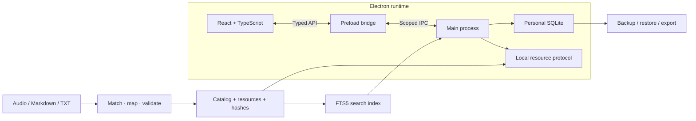

<div align="center">


# LearnKit · 学匣

### Build your own desktop learning app from audio and documents

[](../../LICENSE)
[](../../app/package.json)
[](../../README.md)

[简体中文](../../README.md) · [English](README.en.md) · [日本語](README.ja.md) · [한국어](README.ko.md)

[Application preview](#application-preview) · [Quick start](#quick-start) · [Architecture](#architecture) · [Import your courses](#import-your-materials) · [AI development guide](../AI_GUIDE.md)

</div>

---

## Overview

LearnKit is a reusable desktop learning framework for developers, content creators and AI coding tools. It connects a course import pipeline with a working desktop application for listening, reading, notes, study planning and spaced review.

Import your own materials, confirm the file mapping, configure the brand and adapt the interface. The runtime works offline without accounts, activation codes or an AI API. The public repository includes code, documentation and self-created sample text, rather than a third-party course collection.

### One framework for listening, reading and reflection

<table>
  <tr>
    <td width="50%" valign="top">
      
      <h3>Listen and read</h3>
      <p>Listen to audio while reading a document. Keep playback running across pages, and return to important passages with search, highlights and bookmarks.</p>
    </td>
    <td width="50%" valign="top">
      
      <h3>Capture and revisit</h3>
      <p>Turn excerpts into notes, then revisit them with study plans and spaced review. Personal records stay on your computer, with backup and export tools.</p>
    </td>
  </tr>
</table>

*The banner and feature illustrations are AI-generated conceptual artwork; the screenshot below shows the actual application.*

## Application preview


*Actual application screenshot using self-created demo data. Documentation is available in four languages; the application UI is currently primarily Chinese.*

## Quick start

```powershell
git clone https://github.com/shianlab/learnkit.git
cd learnkit
npm --prefix app ci
npm --prefix app run prepare:demo
npm --prefix app run dev
```

The four self-created lessons cover paired audio/text, text-only and audio-only content in two groups. Generated audio is a low-volume test tone, not spoken course material. The demo generator refuses to replace a custom course library.

### From materials to an app

| 01 · Prepare | 02 · Check and generate | 03 · Customize and distribute |
| --- | --- | --- |
| Organize audio and Markdown/TXT documents | Check matching with dry-run, resolve conflicts, then generate the library | Configure branding and stable identities, verify, then package the complete program folder |

## Capabilities

| Module | Implemented capabilities |
| --- | --- |
| Course pipeline | Filename matching, explicit JSON mappings, ambiguity reports, stable IDs, SHA256 resource hashes and staged library generation |
| Audio | Playback across pages, speed, volume, queue, continuous playback, sleep timer, bookmarks and resume |
| Reading | Markdown/TXT, Chinese full-text search, paragraph navigation, in-document search, typography, themes and local images |
| Notes | Course and independent notes, excerpts, tags, image attachments, annotations, bookmarks and Markdown/PDF export |
| Learning | Selected-course plans, daily goals, actual listening/reading time, heard coverage, review cards and self-assessment |
| Data lifecycle | SQLite persistence, migrations, automatic/manual backup, restore validation, undo and recovery |

Groups, lesson counts and dashboard statistics come from the imported library. They are not tied to a particular author or a fixed number of seasons.

## Technology stack

| Technology | Version | Responsibility |
| --- | --- | --- |
| Electron | 44.5.1 | Desktop runtime, windows, media and system APIs |
| React / TypeScript | 19.3.0 / 7.0.2 | Typed components and application state |
| Vite / Electron Packager | 8.3.2 / 20.3.0 | Frontend build, ASAR and Windows packaging |
| SQLite / node:sqlite | Runtime-provided | Personal data, transactions and snapshots |
| SQLite FTS5 | Trigram tokenizer | Chinese full-text search and short-query fallback |
| react-markdown / remark-gfm | 10.1.0 / 4.0.1 | Markdown and GFM rendering |
| Lucide React / CSS | 1.51.0 / custom CSS | SVG icons, layout and themes |
| Node Test Runner / Playwright | Built-in / optional | Automated and native-window checks |

Exact dependency versions are defined in [package.json](../../app/package.json) and [package-lock.json](../../app/package-lock.json). Development requires **Node.js ≥ 24.13.0**. End users do not need Node.js to run the packaged application.

## Architecture



The React renderer communicates through a controlled preload API. The main process manages resources, search, SQLite and system operations. Audio and the selected reading lesson have independent lifecycles; changing pages keeps the player mounted.

Course resources and search indexes are distributed with the program. Personal notes, progress and review records live in separate user-data directories identified by the application and library. Stable IDs help preserve links when content is updated. The runtime retains context isolation, sandboxing, CSP, sender validation and resource-path checks.

See the [architecture guide](../ARCHITECTURE.md) for implementation boundaries; detailed technical guides are currently in Chinese.

## Import your materials

```text
course-input/
├── Basics/
│   ├── 01-Introduction.md
│   ├── 01-Introduction.mp3
│   └── 02-Reading.txt
└── Advanced/
    ├── 01-Practice.md
    └── 01-Practice.m4a
```

Audio and text with the same filename stem in the same group are paired. Separate `audio`/`texts` containers are supported. Unpaired files remain text-only or audio-only lessons. Multiple candidates stop the import and produce a report rather than a guessed match.

```powershell
npm --prefix app run import:library -- --input ../course-input --dry-run
npm --prefix app run import:library -- --input ../course-input
npm --prefix app run dev
```

Inspect `build/import-report.json` before importing. When names differ, provide a `courses.json` mapping with explicit IDs, titles, groups, text and audio paths. See [import documentation](../IMPORT.md).

| Content | Current support |
| --- | --- |
| Documents | UTF-8 Markdown and TXT |
| Audio | MP3, M4A, WAV, OGG and FLAC |
| Document images | Local PNG, JPEG and WebP |
| PDF / Word / scanned documents | Convert to Markdown/TXT first; document extraction and OCR are not built in |
| Audio duration | Optional ffprobe during import; otherwise read by the player |

Close the app before replacing its library. Importing regenerates course resources without intentionally deleting personal records. Keep existing IDs in a mapping when renaming or moving input files.

## Branding and AI-assisted development

Edit [app/app.config.json](../../app/app.config.json): `name`, `subtitle`, default `author`, stable `appId` and default `libraryId`. Use a new app ID for an independent application; retain existing data identities when merely changing its brand.

The [AI guide](../AI_GUIDE.md) includes a reusable prompt and a workflow: inspect architecture, scan files, confirm mappings, validate a small sample, then customize and distribute. AI assists development; the running application does not require an AI service.

## Verification

```powershell
npm --prefix app test
npm --prefix app run build
```

The current **30 automated regression checks** cover matching, ambiguity, path boundaries, seven dynamic groups, stable IDs, Chinese search, notes, annotations, study timing, migrations and backup/restore. They use isolated self-created fixtures, not the active course library.

Development and packaged builds have passed local Electron window checks for continuous playback, independent reading, note flushing, audio-only courses, search, dynamic plans, small-window layout and persistence after restart. These are recorded local checks, not a live CI guarantee.

Native demo checks require optional Playwright and a demo prepared in a fresh copy:

```powershell
npm --prefix app install --no-save --package-lock=false playwright
node scripts/verify/smoke.mjs
node scripts/verify/smoke.mjs --packaged
```

## Packaging and distribution

```powershell
npm --prefix app run package
```

```text
build/program/LearnKit-win32-x64/
├── LearnKit.exe
├── resources/
│   ├── app.asar
│   ├── library/
│   └── search-v1.sqlite
└── Electron runtime files...
```

Distribute the **entire folder**. Recipients run `LearnKit.exe` without a development environment. The directory contains the imported courses and Electron runtime, but not your personal notes. Sending only the EXE is insufficient.

Packaging obtains the official Electron runtime by default. An offline build can use the matching ZIP in `tools/electron`. The framework builds a portable Windows folder; installers and automatic updates are not included.

## Repository layout

```text
learnkit/
├── app/
│   ├── app.config.json
│   ├── src/
│   ├── desktop/
│   ├── scripts/
│   └── tests/
├── examples/course-input/
├── scripts/verify/
├── docs/
├── AGENTS.md
└── CONTRIBUTING.md
```

The repository excludes dependencies, build outputs, user courses, generated libraries, credentials and personal backups through Git ignore rules.

## Project status

- **0.1.0 development framework** for customization and validation.
- Windows x64 development and packaged execution verified locally; macOS/Linux require adaptation and testing.
- Four-language project documentation; no application language switch yet.
- CLI import and JSON mappings; in-app drag-and-drop import is not implemented.
- Large libraries, multi-hour stability, concurrent applications and physical system sleep require additional environment-specific checks.
- PDF/Word parsing, OCR, transcription and cloud synchronization are not implemented.

## Contributing and license

Report reproducible issues via [GitHub Issues](https://github.com/shianlab/learnkit/issues), or submit a focused pull request with verification results. See [CONTRIBUTING.md](../../CONTRIBUTING.md); AI coding tools should read [AGENTS.md](../../AGENTS.md).

Original code, documentation, self-created examples and the generic book icon use the [MIT License](../../LICENSE). Fonts and third-party components retain their own licenses; see [third-party notices](../../THIRD_PARTY_NOTICES.md). Imported content retains its own ownership and licensing.
