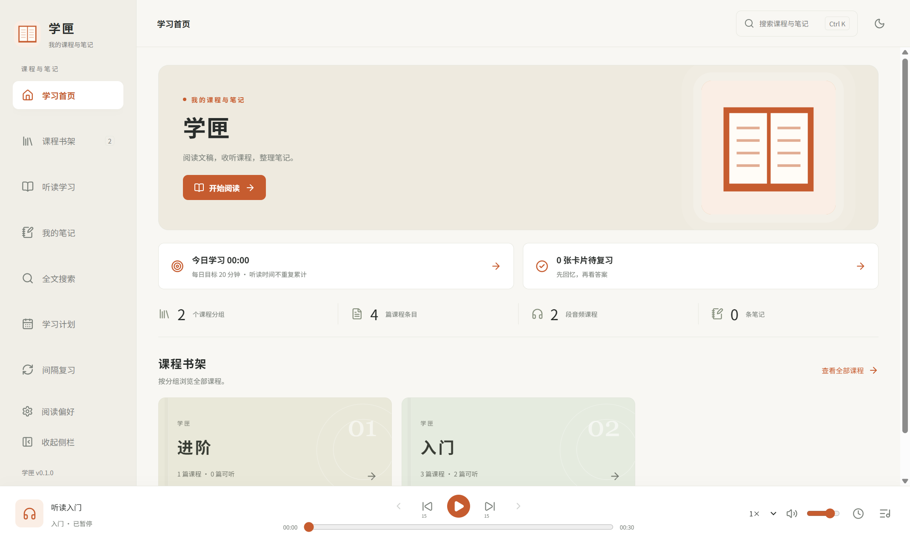
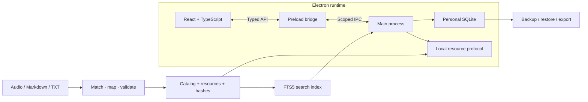

<div align="center">


# LearnKit · 学匣

### 音声と文書から、自分のデスクトップ学習アプリを構築

[](../../LICENSE)
[](../../app/package.json)
[](../../README.md)

[简体中文](../../README.md) · [English](README.en.md) · [日本語](README.ja.md) · [한국어](README.ko.md)

[アプリの画面](#アプリの画面) · [クイックスタート](#クイックスタート) · [アーキテクチャ](#アーキテクチャ) · [教材のインポート](#自分の教材をインポート) · [AI 開発ガイド](../AI_GUIDE.md)

</div>

---

## プロジェクト概要

LearnKit は、開発者、コンテンツ制作者、AI コーディングツール向けの再利用可能なデスクトップ学習アプリのフレームワークです。教材のインポートから、音声再生、読書、ノート、学習計画、間隔反復までを一つの基盤として提供します。

自分の教材を用意し、音声と文書の対応を確認してから、アプリ名や画面を調整できます。実行時にアカウント、アクティベーションコード、AI API は不要です。公開リポジトリにはコード、ドキュメント、自作のサンプル文章を収録しており、第三者の講座教材は含みません。

### 聴く・読む・整理するを、一つの基盤で

<table>
  <tr>
    <td width="50%" valign="top">
      
      <h3>聴きながら、読み進める</h3>
      <p>音声を聴きながら文書を読む。画面を移動しても再生は続き、検索・ハイライト・ブックマークで大切な段落に戻れます。</p>
    </td>
    <td width="50%" valign="top">
      
      <h3>記録して、振り返る</h3>
      <p>抜粋をノートにまとめ、学習計画と間隔反復で振り返る。個人の記録はローカルに保存され、バックアップとエクスポートができます。</p>
    </td>
  </tr>
</table>

*バナーとイラストは AI 生成のコンセプト画像です。下のスクリーンショットは実際のアプリ画面です。*

## アプリの画面



*自作データを使用した実際の画面です。プロジェクト文書は 4 言語で提供していますが、アプリの UI は現在主に中国語です。*

## クイックスタート

```powershell
git clone https://github.com/shianlab/learnkit.git
cd learnkit
npm --prefix app ci
npm --prefix app run prepare:demo
npm --prefix app run dev
```

自作の 4 講座で、音声と文書の組、文書のみ、音声のみを確認できます。サンプル音声は低音量のテスト音であり、講義ではありません。デモ生成処理は、インポート済みの独自教材庫を上書きしません。

### 教材からアプリへ

| 01 · 教材を準備 | 02 · 確認して生成 | 03 · カスタマイズと配布 |
| --- | --- | --- |
| 音声と Markdown/TXT 文書を整理 | dry-run で対応を確認し、競合を解消して教材を生成 | ブランドと安定した識別子を設定し、検証後にプログラム全体をパッケージ化 |

## 主な機能

| モジュール | 実装済みの機能 |
| --- | --- |
| 教材処理 | ファイル名による対応付け、JSON マッピング、競合レポート、安定した ID、SHA256、ステージングによる教材生成 |
| 音声 | 画面を移動しても続く再生、速度、音量、キュー、連続再生、停止タイマー、ブックマーク、再開位置 |
| 文書 | Markdown/TXT、中国語全文検索、段落移動、文書内検索、文字組み、テーマ、ローカル画像 |
| ノート | 講座ノート、独立ノート、抜粋、タグ、画像添付、ハイライト、ブックマーク、Markdown/PDF 出力 |
| 学習 | 講座を選択する計画、日々の目標、実際の学習時間、再生済み範囲、復習カード、自己評価 |
| データ管理 | SQLite、移行、自動/手動バックアップ、復元前検証、削除の取り消しと回復 |

グループ、講座数、統計は実際の教材から生成します。特定の著者や固定のシーズン数には依存しません。

## 技術スタック

| 技術 | バージョン | 役割 |
| --- | --- | --- |
| Electron | 44.5.1 | デスクトップ実行環境、ウィンドウ、音声、システム API |
| React / TypeScript | 19.3.0 / 7.0.2 | 型付きコンポーネントとアプリ状態 |
| Vite / Electron Packager | 8.3.2 / 20.3.0 | フロントエンド、ASAR、Windows 配布 |
| SQLite / node:sqlite | 実行環境に内蔵 | 個人データ、トランザクション、スナップショット |
| SQLite FTS5 | trigram | 中国語全文検索と短い検索語の補完 |
| react-markdown / remark-gfm | 10.1.0 / 4.0.1 | Markdown と GFM |
| Lucide React / CSS | 1.51.0 / 独自 CSS | SVG アイコン、レイアウト、テーマ |
| Node Test Runner / Playwright | 内蔵 / 任意 | 自動テストと実際の Electron 画面検証 |

正確な依存関係は [package.json](../../app/package.json) と [ロックファイル](../../app/package-lock.json) を参照してください。開発には **Node.js 24.13.0 以上**が必要です。配布されたアプリの利用者は Node.js をインストールする必要がありません。

## アーキテクチャ



React レンダラーは preload API を介してメインプロセスと通信します。メインプロセスが教材、検索、SQLite、システム操作を管理します。音声と読書中の講座を別々に扱うため、ページを変更してもプレーヤーは維持されます。

教材と検索インデックスはアプリと一緒に配布し、個人のノートや進捗はアプリおよび教材庫の識別子に基づくユーザーデータ領域に保存します。contextIsolation、sandbox、CSP、IPC 送信元の検証、パス境界の確認を維持します。

実装の詳細は [構成ガイド](../ARCHITECTURE.md) を参照してください。詳細な技術ガイドは現在中国語です。

## 自分の教材をインポート

```text
course-input/
├── Basics/
│   ├── 01-Introduction.md
│   ├── 01-Introduction.mp3
│   └── 02-Reading.txt
└── Advanced/
    ├── 01-Practice.md
    └── 01-Practice.m4a
```

同じグループで拡張子を除く名前が一致する音声と文書を対応付けます。audio/texts を分けたディレクトリも利用できます。片方だけの教材も保持し、候補が複数ある場合は推測せずレポートを作成して停止します。

```powershell
npm --prefix app run import:library -- --input ../course-input --dry-run
npm --prefix app run import:library -- --input ../course-input
npm --prefix app run dev
```

インポート前に `build/import-report.json` を確認してください。名前が異なる教材は courses.json に ID、タイトル、グループ、音声と文書のパスを明記できます。[インポートガイド](../IMPORT.md) に形式を記載しています。

| 教材 | 現在の対応 |
| --- | --- |
| 文書 | UTF-8 Markdown、TXT |
| 音声 | MP3、M4A、WAV、OGG、FLAC |
| 挿絵 | ローカル PNG、JPEG、WebP |
| PDF / Word / スキャン | 先に Markdown/TXT へ変換。文書解析と OCR は未実装 |
| 音声の長さ | インポート時の ffprobe は任意。未導入なら再生時に取得 |

教材を更新する前にアプリを終了してください。生成教材を置き換えても、個人記録を意図的に削除しません。ファイル名や場所を変更する際は、マッピングで既存の講座 ID を保持してください。

## ブランド設定と AI 開発

[app/app.config.json](../../app/app.config.json) の name、subtitle、author、appId、libraryId を設定します。別のアプリには新しい appId を使用し、既存アプリの名前だけを変更する場合はデータの識別子を保持してください。

[AI 開発ガイド](../AI_GUIDE.md) には、コピーして使える指示文と作業順序があります。構成の理解、ファイル確認、対応付け、小さなサンプルの検証を行ってから、画面と配布方法を調整します。アプリの実行自体に AI サービスは必要ありません。

## 検証

```powershell
npm --prefix app test
npm --prefix app run build
```

**30 項目の自動回帰テスト**で、対応付け、競合、パス境界、7 グループ、安定した ID、中国語検索、ノート、批注、計時、移行、バックアップと復元を確認します。現在の教材庫とは別の自作テストデータを使用します。

開発版と配布版では、継続再生、独立した読書、ノート保存、音声のみの教材、検索、計画、小さなウィンドウ、再起動後の保存を実際の Electron ウィンドウで検証しています。これはローカルの実行結果であり、継続的な CI の保証ではありません。

ネイティブ画面テストには Playwright と空のコピーで準備したデモが必要です。

```powershell
npm --prefix app install --no-save --package-lock=false playwright
node scripts/verify/smoke.mjs
node scripts/verify/smoke.mjs --packaged
```

## 配布

```powershell
npm --prefix app run package
```

```text
build/program/LearnKit-win32-x64/
├── LearnKit.exe
├── resources/
│   ├── app.asar
│   ├── library/
│   └── search-v1.sqlite
└── Electron runtime files...
```

**フォルダー全体**を配布してください。利用者は LearnKit.exe を開くだけで実行できます。教材と Electron 実行環境を含みますが、作成者の個人ノートは含みません。EXE だけでは動作しません。

通常は公式 Electron 実行環境を取得します。オフラインのビルドでは、対応する ZIP を tools/electron に置けます。現在は Windows のポータブルフォルダーを生成し、インストーラーと自動更新は提供していません。

## リポジトリ構成

```text
learnkit/
├── app/
│   ├── app.config.json
│   ├── src/
│   ├── desktop/
│   ├── scripts/
│   └── tests/
├── examples/course-input/
├── scripts/verify/
├── docs/
├── AGENTS.md
└── CONTRIBUTING.md
```

依存関係、ビルド結果、ユーザー教材、生成教材庫、認証情報、個人バックアップは Git の除外規則で管理します。

## プロジェクトの状態

- **0.1.0 開発フレームワーク**。用途に合わせた開発と検証を想定しています。
- Windows x64 の開発実行と配布版をローカル検証済み。macOS/Linux は対応と実機テストが必要です。
- 文書は 4 言語。アプリ内の言語切り替えは未実装です。
- インポートは CLI と JSON。アプリ内ドラッグ＆ドロップは未実装です。
- 大規模教材、数時間の安定性、複数アプリ同時実行、実際のスリープは環境別の検証が必要です。
- PDF/Word 解析、OCR、音声文字起こし、クラウド同期は未実装です。

## コントリビューションとライセンス

再現手順を添えて [Issue](https://github.com/shianlab/learnkit/issues) を作成するか、検証結果付きの Pull Request を送ってください。[CONTRIBUTING.md](../../CONTRIBUTING.md) を参照し、AI ツールは [AGENTS.md](../../AGENTS.md) を先に読んでください。

独自コード、文書、自作サンプル、汎用ブックアイコンは [MIT](../../LICENSE) です。フォントと外部コンポーネントはそれぞれのライセンスを維持します。[第三者ライセンス](../../THIRD_PARTY_NOTICES.md) を参照してください。ユーザーがインポートする教材の権利は変わりません。
