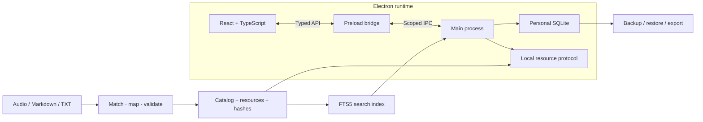

<div align="center">

# LearnKit · 学匣

### 오디오와 문서로 나만의 데스크톱 학습 앱 만들기

[](../../LICENSE)
[](../../app/package.json)
[](../../README.md)
[](../../app/package.json)
[](../../app/package.json)
[](../../app/package.json)

[简体中文](../../README.md) · [English](README.en.md) · [日本語](README.ja.md) · [한국어](README.ko.md)

</div>

---

## 프로젝트 소개

LearnKit은 개발자, 콘텐츠 제작자, AI 코딩 도구를 위한 재사용 가능한 데스크톱 학습 앱 프레임워크입니다. 자료 가져오기부터 듣기, 읽기, 노트, 학습 계획, 간격 반복 복습까지 연결된 기반을 제공합니다.

자신의 자료를 준비하고 오디오와 문서의 연결을 확인한 뒤 앱 이름과 화면을 수정할 수 있습니다. 실행 시 계정, 활성화 코드, AI API가 필요하지 않습니다. 공개 저장소에는 코드, 문서, 직접 만든 예제 텍스트가 포함되며 제삼자의 강의 자료는 제공하지 않습니다.


*직접 만든 예제 데이터를 사용하는 실제 앱 화면입니다. 프로젝트 문서는 4개 언어로 제공하지만 앱 UI는 현재 주로 중국어입니다.*

## 주요 기능

| 모듈 | 구현된 기능 |
| --- | --- |
| 자료 처리 | 파일명 매칭, JSON 명시적 매핑, 충돌 보고서, 안정적인 ID, SHA256, 임시 디렉터리를 이용한 자료 생성 |
| 오디오 | 페이지 이동 중 계속 재생, 속도, 음량, 대기열, 연속 재생, 정지 타이머, 북마크, 이어 듣기 |
| 읽기 | Markdown/TXT, 중국어 전문 검색, 문단 이동, 문서 내 검색, 글꼴 크기, 테마, 로컬 이미지 |
| 노트 | 강의 노트, 독립 노트, 발췌, 태그, 이미지 첨부, 하이라이트, 북마크, Markdown/PDF 내보내기 |
| 학습 | 선택형 강의 계획, 일일 목표, 실제 듣기/읽기 시간, 재생 범위, 복습 카드, 자기 평가 |
| 데이터 | SQLite 저장, 마이그레이션, 자동/수동 백업, 복원 전 검증, 삭제 취소 및 복구 |

그룹, 강의 수, 통계는 실제 자료에서 생성됩니다. 특정 저자나 고정된 시즌 수에 연결되어 있지 않습니다.

## 기술 스택

| 기술 | 버전 | 역할 |
| --- | --- | --- |
| Electron | 44.5.1 | 데스크톱 런타임, 창, 미디어, 시스템 API |
| React / TypeScript | 19.3.0 / 7.0.2 | 타입 기반 컴포넌트와 앱 상태 |
| Vite / Electron Packager | 8.3.2 / 20.3.0 | 프런트엔드 빌드, ASAR, Windows 패키징 |
| SQLite / node:sqlite | 런타임 내장 | 개인 데이터, 트랜잭션, 스냅샷 |
| SQLite FTS5 | trigram | 중국어 전문 검색 및 짧은 검색어 처리 |
| react-markdown / remark-gfm | 10.1.0 / 4.0.1 | Markdown 및 GFM 렌더링 |
| Lucide React / CSS | 1.51.0 / 자체 CSS | SVG 아이콘, 레이아웃, 테마 |
| Node Test Runner / Playwright | 내장 / 선택 설치 | 자동 테스트 및 실제 Electron 창 검사 |

정확한 의존성은 [package.json](../../app/package.json)과 [잠금 파일](../../app/package-lock.json)을 확인하세요. 개발에는 **Node.js 24.13.0 이상**이 필요합니다. 패키징된 앱을 사용하는 사람은 Node.js를 설치할 필요가 없습니다.

## 아키텍처



React 렌더러는 preload API를 통해 메인 프로세스와 통신합니다. 메인 프로세스는 자료, 검색, SQLite, 시스템 작업을 관리합니다. 듣는 강의와 읽는 강의의 상태를 분리하므로 페이지를 바꾸어도 플레이어가 유지됩니다.

강의 자료와 검색 인덱스는 프로그램과 함께 배포합니다. 개인 노트, 진도, 복습 기록은 앱과 자료 라이브러리 ID에 따라 별도의 사용자 데이터 영역에 저장됩니다. contextIsolation, sandbox, CSP, IPC 발신자 검증, 파일 경로 검사를 유지합니다.

구현 경계는 [아키텍처 가이드](../ARCHITECTURE.md)를 참조하세요. 상세 기술 가이드는 현재 중국어로 작성되어 있습니다.

## 빠른 시작

```powershell
git clone https://github.com/shianlab/learnkit.git
cd learnkit
npm --prefix app ci
npm --prefix app run prepare:demo
npm --prefix app run dev
```

직접 만든 4개 강의로 오디오/문서 쌍, 문서 전용, 오디오 전용을 확인할 수 있습니다. 생성되는 오디오는 작은 음량의 테스트 톤이며 실제 강의가 아닙니다. 데모 생성기는 이미 가져온 사용자 자료 라이브러리를 덮어쓰지 않습니다.

## 내 자료 가져오기

```text
course-input/
├── Basics/
│   ├── 01-Introduction.md
│   ├── 01-Introduction.mp3
│   └── 02-Reading.txt
└── Advanced/
    ├── 01-Practice.md
    └── 01-Practice.m4a
```

같은 그룹에서 확장자를 제외한 이름이 같은 오디오와 문서를 연결합니다. audio/texts를 분리한 디렉터리도 지원합니다. 한쪽 자료만 있어도 강의로 유지하며, 후보가 여러 개이면 추측하지 않고 보고서를 생성한 뒤 중지합니다.

```powershell
npm --prefix app run import:library -- --input ../course-input --dry-run
npm --prefix app run import:library -- --input ../course-input
npm --prefix app run dev
```

가져오기 전에 build/import-report.json을 확인하세요. 파일명이 다르면 courses.json에 ID, 제목, 그룹, 문서와 오디오 경로를 명시할 수 있습니다. 형식은 [가져오기 가이드](../IMPORT.md)에 있습니다.

| 자료 | 현재 지원 |
| --- | --- |
| 문서 | UTF-8 Markdown, TXT |
| 오디오 | MP3, M4A, WAV, OGG, FLAC |
| 문서 이미지 | 로컬 PNG, JPEG, WebP |
| PDF / Word / 스캔 | 먼저 Markdown/TXT로 변환. 문서 추출 및 OCR은 미구현 |
| 오디오 길이 | 가져오기 시 ffprobe 선택 사용. 없으면 플레이어에서 읽음 |

자료를 교체하기 전에 앱을 종료하세요. 가져오기는 생성된 자료 라이브러리를 교체하지만 개인 기록을 의도적으로 삭제하지 않습니다. 파일명이나 위치를 바꾸는 경우 매핑을 통해 기존 강의 ID를 유지하세요.

## 브랜드 설정과 AI 개발

[app/app.config.json](../../app/app.config.json)에서 name, subtitle, author, appId, libraryId를 설정합니다. 독립적인 앱에는 새 appId를 사용하고, 기존 앱의 이름만 바꿀 때는 데이터 식별자를 유지하세요.

[AI 개발 가이드](../AI_GUIDE.md)는 복사해서 사용할 프롬프트와 작업 순서를 제공합니다. 구조 이해, 파일 확인, 명시적 매핑, 작은 샘플 검증 후 화면과 배포 방식을 수정하세요. AI는 개발을 돕고, 앱 실행 자체는 AI 서비스를 요구하지 않습니다.

## 검증

```powershell
npm --prefix app test
npm --prefix app run build
```

**30개 자동 회귀 테스트**가 매칭, 충돌, 경로 경계, 7개 동적 그룹, 안정적인 ID, 중국어 검색, 노트, 주석, 학습 시간, 마이그레이션, 백업과 복원을 다룹니다. 현재 자료와 분리된 자체 예제 데이터를 사용합니다.

개발판과 패키징된 앱에서 지속 재생, 독립적인 읽기, 노트 저장, 오디오 전용 강의, 검색, 계획, 작은 창, 재시작 후 저장을 실제 Electron 창으로 검증했습니다. 이는 로컬 실행 결과이며 지속적인 CI 보장을 뜻하지 않습니다.

네이티브 창 검사에는 Playwright와 새 복사본에서 준비한 데모가 필요합니다.

```powershell
npm --prefix app install --no-save --package-lock=false playwright
node scripts/verify/smoke.mjs
node scripts/verify/smoke.mjs --packaged
```

## 패키징과 배포

```powershell
npm --prefix app run package
```

```text
build/program/LearnKit-win32-x64/
├── LearnKit.exe
├── resources/
│   ├── app.asar
│   ├── library/
│   └── search-v1.sqlite
└── Electron runtime files...
```

**전체 폴더**를 배포하세요. 사용자는 개발 환경 없이 LearnKit.exe를 실행할 수 있습니다. 폴더에는 가져온 강의와 Electron 런타임이 포함되지만 제작자의 개인 노트는 포함되지 않습니다. EXE 하나만 보내면 실행할 수 없습니다.

기본적으로 공식 Electron 런타임을 가져옵니다. 오프라인 빌드는 tools/electron에 해당 버전 ZIP을 미리 둘 수 있습니다. 현재는 Windows 포터블 폴더를 생성하며 설치 프로그램과 자동 업데이트는 포함하지 않습니다.

## 저장소 구조

```text
learnkit/
├── app/
│   ├── app.config.json
│   ├── src/
│   ├── desktop/
│   ├── scripts/
│   └── tests/
├── examples/course-input/
├── scripts/verify/
├── docs/
├── AGENTS.md
└── CONTRIBUTING.md
```

의존성, 빌드 결과, 사용자 강의, 생성된 라이브러리, 자격 증명, 개인 백업은 Git 제외 규칙으로 관리합니다.

## 프로젝트 상태

- **0.1.0 개발 프레임워크**로, 맞춤 개발과 검증을 위한 기반입니다.
- Windows x64 개발 실행과 패키징 앱을 로컬에서 검증했습니다. macOS/Linux는 수정 및 실기기 테스트가 필요합니다.
- 프로젝트 문서는 4개 언어. 앱 내 언어 전환은 미구현입니다.
- CLI와 JSON 매핑으로 자료를 가져옵니다. 앱 내 드래그 앤 드롭은 미구현입니다.
- 대규모 자료, 여러 시간의 안정성, 여러 앱 동시 실행, 실제 절전은 환경별 추가 검증이 필요합니다.
- PDF/Word 파싱, OCR, 음성 전사, 클라우드 동기화는 미구현입니다.

## 기여와 라이선스

재현 가능한 문제는 [GitHub Issues](https://github.com/shianlab/learnkit/issues)에 등록하거나 검증 결과를 포함한 Pull Request로 제출하세요. [CONTRIBUTING.md](../../CONTRIBUTING.md)를 확인하고 AI 코딩 도구는 [AGENTS.md](../../AGENTS.md)를 먼저 읽어야 합니다.

직접 작성한 코드, 문서, 자체 예제, 일반 책 아이콘에는 [MIT License](../../LICENSE)를 적용합니다. 폰트와 외부 컴포넌트는 각각의 라이선스를 유지합니다. [제삼자 고지](../../THIRD_PARTY_NOTICES.md)를 확인하세요. 가져오는 자료의 소유권과 라이선스는 그대로 유지됩니다.
